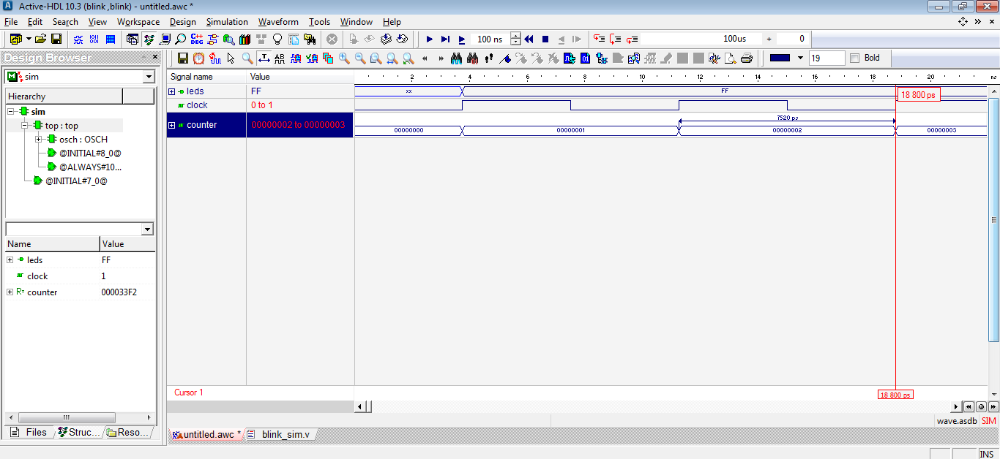

# Blink application

This basic project just verifies that the 
[MachXO2 breakout board](http://www.latticesemi.com/Products/DevelopmentBoardsAndKits/MachXO2BreakoutBoard.aspx) 
and the [Lattice Diamond](http://www.latticesemi.com/latticediamond) toolchain are properly working.
When you program the FPGA make sure that you select the LCMXO2-7000HE-4TG144C device.

The [blink_app.v](blink_app.v) application just increments a 32-bit counter and displays the highest 8-bits on the LEDs. The LED pins are active low, so we invert the values. The FPGA is clocked from its internal RC oscillator running at 133 MHz. 

Using the [blink_sim.v](blink_sim.v) testbench (the Active HDL is Windows only unfortunately) we can simulate the timing of the application, and verify that the counter wires and LED pins are properly updated, and check that one clock cycle is about 1 sec / 133 MHz = 7518 ps.

